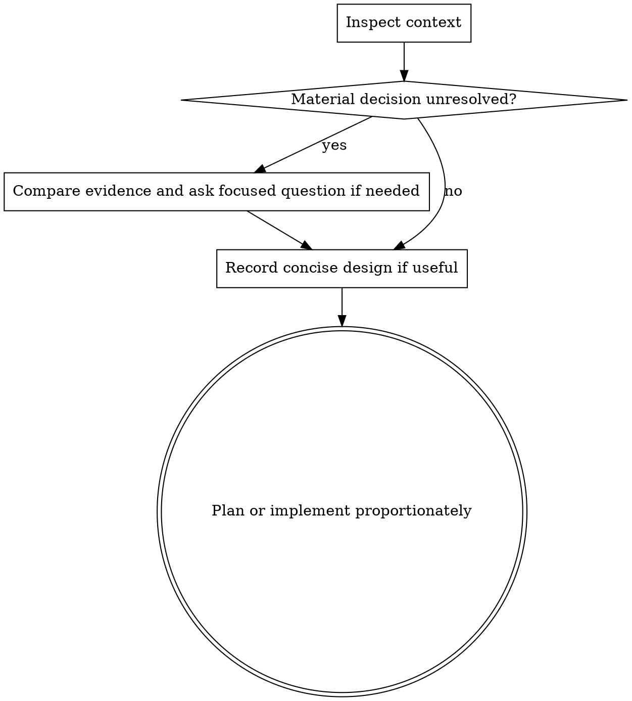

# Brainstorming Ideas Into Designs

Use design exploration when it changes a consequential decision, not as a prerequisite for every edit. Respect an explicit request for interactive design or planning-only work; otherwise, turn an authorized request into a proportionate implementation path.

## When to use or skip

Use brainstorming when architecture, system boundaries, data models, APIs, cross-service interactions, scope, or requirements remain unresolved; when viable approaches have material product or technical trade-offs; or when the user asks to explore, ideate, design, or compare approaches. Ask: **would implementing now silently choose a consequential direction not settled by the request or repository?** If so, explore it.

Skip it for exact localized outcomes; mechanical maintenance such as typos, renames, formatting, dependency bumps, and straightforward configuration; established-behavior bug fixes (use debugging and TDD); and implementation of an approved design, detailed specification, or existing plan. Do not add a test surface or design ceremony solely for a low-risk mechanical edit.

## Process

1. Inspect relevant project context, conventions, constraints, and existing behavior.
2. Resolve routine details from evidence and choose reversible defaults.
3. Compare alternatives when they differ materially in architecture, compatibility, cost, risk, or scope. State the recommendation and trade-offs concisely.
4. Ask one focused question only for a missing decision that materially changes the outcome and cannot be resolved from the repository or request. Continue independent preparation while waiting.
5. Record a design document only when it is useful for a substantial decision or handoff. Use `docs/plans/YYYY-MM-DD-<topic>-design.md` when the project uses that convention.
6. Proceed to a concise implementation plan or implementation as the task size warrants.

Do not require design approval, section-by-section confirmation, a fixed number of alternatives, a commit, or a worktree before implementation. Do not implement when the user asked for a design or plan only.

## Example

For “add CSV export,” inspect existing export conventions and implement format/UI defaults supported by that precedent. If tenant-wide versus requester-only data access is not specified and changes authorization or privacy, ask that question while preparing the independent formatting and test work. Do not invent an access policy or wait for recurring design approval.
