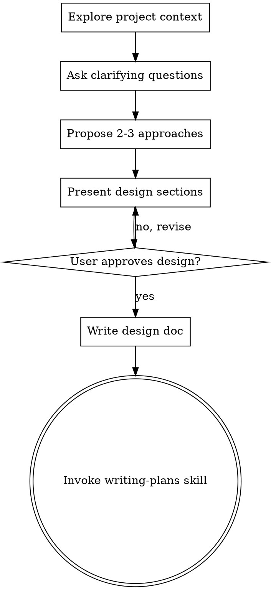

# Brainstorming Ideas Into Designs

## Overview

Help turn consequential, under-specified ideas into fully formed designs and specs through natural collaborative dialogue.

Use judgment before invoking this skill. Brainstorming is valuable when implementation would otherwise commit to important choices the user has not made; it is process overhead when the outcome and approach are already clear.

## When to Use

Use brainstorming when one or more of these apply:

- Architecture, system boundaries, data models, APIs, or cross-service interactions need to be decided
- A large multi-step feature has unresolved scope or requirements
- Several viable approaches have meaningful product or technical trade-offs
- The user asks to explore, ideate, design, or compare approaches
- The requested behavior is unclear enough that implementation risks substantial rework

Skip brainstorming for:

- Exact, localized edits with a prescribed outcome
- Mechanical maintenance such as typo fixes, renames, formatting, dependency bumps, or straightforward configuration changes
- Bug fixes where expected behavior is already established; use systematic debugging and TDD instead
- Implementing an approved design, detailed specification, or existing plan

Ask: **Would starting implementation now silently choose a consequential direction that has not been agreed?** If yes, brainstorm. If no, proceed with the relevant implementation workflow.

<HARD-GATE>
Once this skill is invoked for qualifying work, do NOT invoke an implementation skill, write code, scaffold a project, or take implementation action until you have presented a design and the user has approved it.
</HARD-GATE>

## Checklist

You MUST create a task for each of these items and complete them in order:

1. **Explore project context** — check files, docs, recent commits
2. **Ask clarifying questions** — one at a time, understand purpose/constraints/success criteria
3. **Propose 2-3 approaches** — with trade-offs and your recommendation
4. **Present design** — in sections scaled to their complexity, get user approval after each section
5. **Write design doc** — save to `docs/plans/YYYY-MM-DD-<topic>-design.md` and commit
6. **Transition to implementation** — invoke writing-plans skill to create implementation plan

## Process Flow

**The terminal state is invoking writing-plans.** Do NOT invoke frontend-design, mcp-builder, or any other implementation skill. The ONLY skill you invoke after brainstorming is writing-plans.

## The Process

**Understanding the idea:**
- Check out the current project state first (files, docs, recent commits)
- Ask questions one at a time to refine the idea
- Prefer multiple choice questions when possible, but open-ended is fine too
- Only one question per message - if a topic needs more exploration, break it into multiple questions
- Focus on understanding: purpose, constraints, success criteria

**Exploring approaches:**
- Propose 2-3 different approaches with trade-offs
- Present options conversationally with your recommendation and reasoning
- Lead with your recommended option and explain why

**Presenting the design:**
- Once you believe you understand what you're building, present the design
- Scale each section to its complexity: a few sentences if straightforward, up to 200-300 words if nuanced
- Ask after each section whether it looks right so far
- Cover: architecture, components, data flow, error handling, testing
- Be ready to go back and clarify if something doesn't make sense

## After the Design

**Documentation:**
- Write the validated design to `docs/plans/YYYY-MM-DD-<topic>-design.md`
- Use elements-of-style:writing-clearly-and-concisely skill if available
- Commit the design document to git

**Implementation:**
- Invoke the writing-plans skill to create a detailed implementation plan
- Do NOT invoke any other skill. writing-plans is the next step.

## Key Principles

- **Use judgment at the trigger** - Do not invoke this skill merely because any behavior changes
- **Scale process to consequence** - Reserve full design work for decisions with meaningful scope, ambiguity, or trade-offs
- **One question at a time** - Don't overwhelm with multiple questions
- **Multiple choice preferred** - Easier to answer than open-ended when possible
- **YAGNI ruthlessly** - Remove unnecessary features from all designs
- **Explore alternatives** - Always propose 2-3 approaches before settling
- **Incremental validation** - Present design, get approval before moving on
- **Be flexible** - Go back and clarify when something doesn't make sense
