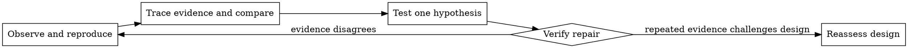

# Systematic Debugging

## Purpose

Replace guess-and-check with evidence: reproduce the symptom, trace the relevant path, compare a working case, test one hypothesis, and verify the repair. Adapt the depth to impact and reversibility. A well-understood typo can use a focused check; an incident or cross-component failure deserves deeper instrumentation.

## Investigation loop



### 1. Observe and reproduce

Read the actual error, identify its scope, and capture a reproducible command or scenario where possible. Check recent relevant changes and distinguish baseline/environment failures from regressions introduced by the work.

For a pipeline such as CI → build → signing, instrument boundaries rather than guessing:

```bash
if [ -n "${IDENTITY:-}" ]; then
  echo "workflow identity: SET"
else
  echo "workflow identity: UNSET"
fi
security find-identity -v # diagnostic inspection; do not print $IDENTITY
```

Only after this diagnostic evidence identifies the cause, run the mutating signing operation in its authorized step:

```bash
codesign --sign "$IDENTITY" --verbose=4 "$APP"
```

This locates the boundary that lost state without exposing secret values.

### 2. Trace and compare

Trace a bad value backward to its source. Find a comparable working path and list relevant differences: inputs, state, configuration, timing, dependencies, and environment. For a multi-layer failure, use [root-cause tracing](root-cause-tracing.md); add [defense in depth](defense-in-depth.md) when the same bad input should be rejected at multiple boundaries. Read the portion of a reference implementation needed to establish the pattern; do not blindly copy a patch because it looks familiar.

### 3. Test a single hypothesis

State a falsifiable explanation: “The status remains pending because the event handler commits after the assertion.” Make the smallest safe experiment that can disprove it. Keep independent changes separate so the result remains interpretable. When timing or eventual state is the suspected cause, use [condition-based waiting](condition-based-waiting.md) rather than arbitrary sleeps.

### 4. Repair and verify

Fix the identified cause, add a focused regression test when practical, and run checks proportional to the affected area. Existing code that receives a test later stays in place; a characterization test is useful evidence even when historical red evidence is unavailable.

## Repeated failed hypotheses

After repeated failed, evidence-based attempts—or sooner when evidence exposes shared-state, coupling, or a design mismatch—pause patching and write down the observations. Request a planner/architecture review when one is available. Ask the user only if the reassessment exposes a material choice about scope, compatibility, cost, or authorization. Continue independent investigation rather than waiting on routine uncertainty.

## Incidents

For an outage, stabilize safely when an authorized, reversible mitigation exists (for example, rollback, feature flag, or rate limit), while preserving diagnostics and investigating the cause. Do not treat urgency, seniority, or a plausible anecdote as proof. State the tradeoff and evidence.

## Useful outcomes

- **Confirmed cause:** implement the narrow repair and regression evidence.
- **Environmental/external cause:** document what was checked, add appropriate handling or monitoring, and mark unavailable verification.
- **Unresolved material decision:** present the evidence and the smallest question that changes the outcome.

Do not claim a fix merely because a patch was applied; report the reproduction and verification result.
