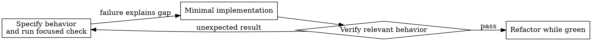

# Test-Driven Development (TDD)

## Purpose

Use a small behavior-oriented test to make intended behavior explicit, then implement the smallest change that satisfies it. TDD is valuable for new behavior and regressions; it is not a reason to discard correct existing work or to override a user's instructions.

## Choose evidence proportional to the change

| Change | Preferred evidence |
| --- | --- |
| New behavior or reproducible bug | Test first when practical; observe the expected failure, then the pass |
| Existing implementation gained tests later | Keep the implementation; add characterization/regression tests and state that red evidence was unavailable |
| Refactor | Existing focused tests before and after |
| Documentation, configuration, generated, or reference-only edit | Parsing, focused static checks, or a scenario review |
| Exploratory prototype | Record the limitation; promote important behavior to tests before relying on it |

A test that cannot be made meaningful is not improved by ritual. Use the project’s test conventions and ask only when a material product decision is unresolved.

## Red → green → refactor



### 1. Specify one observable behavior

```typescript
test('retries a failed operation up to three attempts', async () => {
  let attempts = 0;
  const operation = async () => {
    attempts++;
    if (attempts < 3) throw new Error('fail');
    return 'success';
  };

  await expect(retryOperation(operation)).resolves.toBe('success');
  expect(attempts).toBe(3);
});
```

Prefer real behavior over assertions about mocks. A clear test names one outcome and demonstrates the intended API. When adding mocks, test-only production hooks, or an integration boundary, consult [testing anti-patterns](testing-anti-patterns.md) for focused counterexamples.

### 2. Run the focused test and understand its result

```bash
npm test -- path/to/retry.test.ts
```

For a new behavior, confirm that the failure represents the missing behavior rather than a typo or broken setup. If the test already passes, investigate whether the behavior already exists or the test is ineffective. Do not manufacture a failure by deleting working code.

### 3. Implement and verify

```typescript
async function retryOperation<T>(fn: () => Promise<T>): Promise<T> {
  let lastError: unknown;
  for (let attempt = 0; attempt < 3; attempt++) {
    try { return await fn(); } catch (error) { lastError = error; }
  }
  throw lastError;
}
```

Run the focused check again. Run adjacent or required project checks when the change can affect them. A pre-existing unrelated failure is baseline evidence, not an instruction to repair unrelated code; investigate any new relevant failure.

### Tests added after existing code

When code predates its test, preserve it. Add a characterization test for observed behavior and a regression test for the requested change. State accurately that it is tests-after evidence, then improve coverage incrementally. Do not delete user work merely to recreate a red step.

## Useful signals

- A test is hard to write: reconsider the interface or isolate dependencies.
- A test needs huge setup: extract fixtures or narrow the behavior.
- A mock only proves calls: add an outcome-level assertion where feasible.
- A failure is environmental: document it, use another meaningful check if available, and do not claim it passed.

## Completion evidence

Report the exact command or scenario, its result, and any limitation. Focused evidence supports the behavior it exercised; it does not establish that every test in a repository passes.
